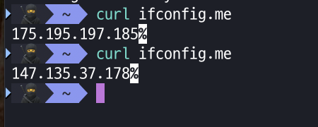

## 목표

- 실제 VPN 트래픽을 생성하여 `.pcap` 파일로 수집
- Scapy를 사용해 캡처된 패킷으로부터 머신러닝 학습용 피처셋(CSV)을 생성

---

## 1. VPN 환경 구성

### ▶ 사용한 VPN

- **VPNBook (https://vpnbook.com)**
- 제공된 `.ovpn` 파일 중 `vpnbook-us178-tcp443.ovpn` 사용

### ▶ macOS 환경에서 OpenVPN 실행

1. Homebrew로 OpenVPN 설치
   ```bash
   brew install openvpn

2. `.ovpn` 파일 사용
    ```bash
    sudo openvpn vpnbook-us178-tcp443.ovpn

    vpnauth id : vpnbook
    vpnauth pw : huba7re

3. 새로운 터미널 창 열기

4. 새로운 터미널에서 ip 변경 확인
    ```bash
    curl ifconfig.me
    ```
    

5. tcpdump를 이용하여 패킷 캡처
    ```bash
    sudo tcpdump -i utun6 -w ~/Desktop/vpn_traffic_$(date +%Y%m%d_%H%M%S).pcap -G 60 -W 1
    ```
    `-w` 저장 위치 설정
    `-G` 캡처 기간 설정
    `-W` 캡처 횟수 설정

## 2. 트래픽 수집

### ▶ Scapy를 이용하여 `.pcap` 파일 분석
- `PcapToCsv.py`파일을 실행하여 `.pcap`파일의 패킷 피처를 추출하고 `csv`파일로 변경하여 머신러닝 학습용 피처셋을 구성

## 3. 결과
- 수집된 VPN 트래픽 패킷 수: 약 6,000개
- 피처셋 저장 위치: vpn_features_20250511.csv
- CSV 포함 주요 피처: src_ip, dst_ip, proto, length, src_port, dst_port, tcp_flags